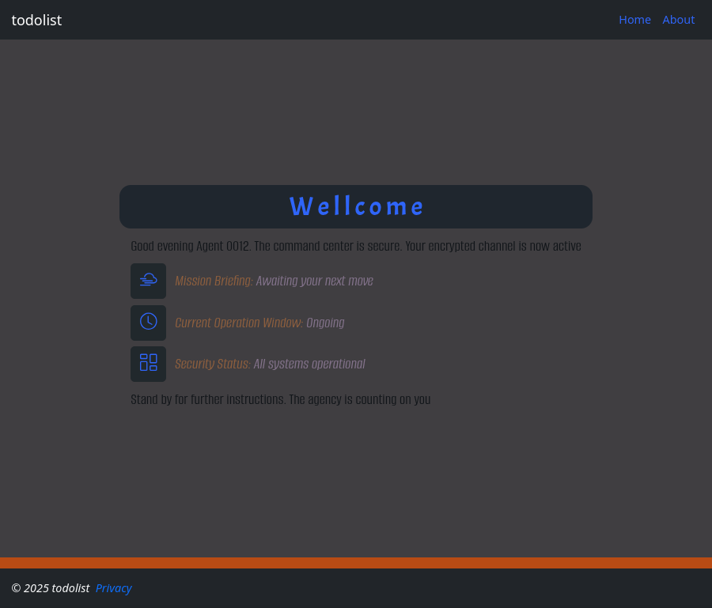
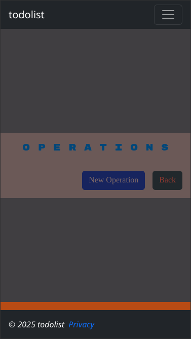

# todolist

## Table of Contents
- [Introduction](#introduction)
- [Installation](#installation)
- [Usage](#usage)
- [FAQ](#faq)

## Introduction
This is a *todolist* app with a spy/intel type of theme. The structure of the
todolist tasks is as follows:

```bash
Operation
---------
- Codename: string
- Status: enum {
    ReceivingTransmission,
    Engaged,
    Sabotaged,
    Declassified,
}
- Missions: List <Mission>
```
This is the most general task it consist of number of missions, each
mission has the following structure:

```c++
Mission
=======
+ IntelReport: string
+ Status: enum  {
    AwaitingActivation,
    Active,
    SilentMode,
    IntelBreached,
    TargetNeutralized,
}
+ OperationWindow: int
+ Operation: Operation
+ Assignments: List <Assignment>
```
*OperationWindow* here is the duration in days, each mission consist of
number of assignments, where *Assignment* is the most basic task and it
looks like this:

```java
Asssignment
~~~~~~~~~~~
> Objectives: string
> Status: enum {
    Pending,
    InProgress,
    TacticalPause,
    TargetOffline,
    Completed,
}
> Mission: Mission
```
The whole stuff looks something like this:
```c#
########################################################################################################
Operation: "Task Force Alpha"                                                                { Engaged }
########################################################################################################
  + Mission: "Neutralize Enemy Activity", 10 days                                             [ Active ]
########################################################################################################
    - Assignment: "Mute hostile radio signals"                                               ( Pending )
    - Assignment: "Deep intel recon"                                                      ( SilentMode )
    - Assignment: "Disrupt enemy supply lines"                                            ( InProgress )
    - Assignment: "Deploy decoys to cover extraction op"                               ( TacticalPause )
########################################################################################################
  + Mission: "Secure High-Value Target", 5 days                                   { AwaitingActivation }
########################################################################################################
    - Assignment: "Identify target movement patterns"                                        ( Pending )
    - Assignment: "Set up safehouse for interrogation"                                    ( InProgress )
########################################################################################################
```

## Installation
If you have *.NET SDK* installed, you can clone the repository and run the app like:
```bash
git clone https://github.com/neznajko/todolist.git
cd todolist
dotnet restore
dotnet run
```
If you have *docker*, only the *docker-compose.yml* file is required, put it into a 
directory, say *todolist* and create a subdirectory, called *db*, for the database: 
```bash
 + todolist/
   - db/
   - docker-compose.yml
```
to start and stop the container, type from the ***todolist*** directory:
```bash
docker compose up -d # start in detached mode( background )
docker compose down  # stop the container
```
And don't forget to visit localhost:8080
## Usage



This is the *Welcome* page, the three buttons lists all Operations, Missions and
Assignments respectively, initially they are all empty, to create new Operation,
click the fyorst button



Now click the *New Operation* button, and fill the form


After hitting the *Create* button, the *Operation Details* page is loaded
where you can add new *Mission*, by clicking the icon with the plus sign


Clicking on one of the missions will lead you to the corresponding 
*Mission Details* page where you can add *Assignments* in a similar
fashion


Basically this is it, if you want to change something click the 
*Edit* button and so forth. One thing to mention is that there is
no nested dump like in the ***Introduction*** but three separate
lists like this:


cos its better having more obscure navigation to keep the things top secret:)

## FAQ

***Q:*** Favorite quote from Sherlock Holmes?

***A:*** *When you eliminate the impossible, whatever remains, however improbable, must be the truth!*
